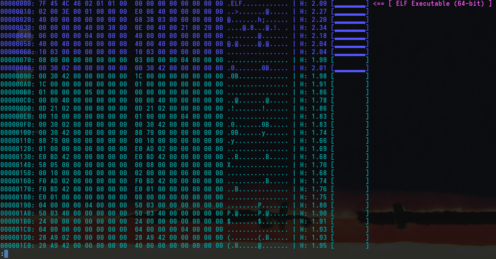
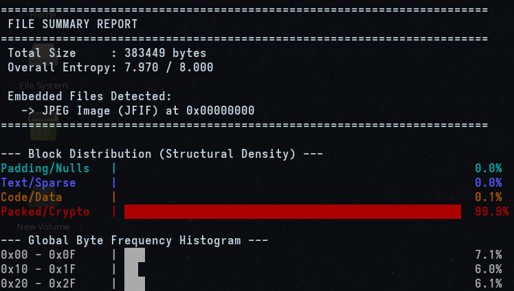

neoxd - hex dumper and analyzer

---



neoxd is a to-date(modern), high-performance, feature-full hex dumper and binary analysis UNIX(i stress that because this is surely not built for Windows as it specifically uses UNIX-specific modules) utility written in Nim, engineered as a modern direct replacement for traditional UNIX tools such as `xxd` and `hexdump` and also most hex dumpers which claims to be replacemnets for the traditional ones.

While xxd and other dumpers present raw binary data as a static, uniform grid of hex bytes, *neoxd* treats binary data as a structured, dynamic information stream. It pairs raw inspection with real-time statistical entropy analysis(using Shannon), automatic signature and file type detection, summarization,  dump reversal and restoration, and proactive CLI guardrails. 

It natively binds to standard C functions to automatically pipe output into a terminal pager (defaulting to `less -RFX`) if the output isn't being redirected to a file.

So, it is simple enough for daily use yet it is far better utility than traditional ones.

---

Operation

If you want a full list, `neoxd -h` in neoxd after installing :3 These are some notable ones:

* Plain Hexadecimal Mode (`-p`, `--plain`)
Emits continuous lower-case hexadecimal output without offsets, spacing, ASCII representations, or entropy metadata just like xxd.

* Summary Mode (`-s`, `--summary`)
Returns a quite insightful summary of the dump which says global file size, overall dataset entropy ($0.000$ to $8.000$), embedded binary header signature locations, a 4-category structural density distribution, and a 16-bucket byte frequency histogram.


* Reverse Binary Conversion Mode (`-r`, `--reverse`)
Reconstructs a raw binary file from a formatted text hex dump or a plain hex stream. In standard reverse mode, neoxd scans lines for the colon delimiter (:), isolates hex digits prior to the pipe character (|), and reassembles raw byte sequences. In plain mode (-r -p), it strips all non-hexadecimal characters and converts pairs of hex characters directly into bytes.

* Dump Restoration & Cleanup Mode (`-R`, `--restore`)
Ingests malformed, edited, or ANSI-colored hex dumps, repairs structural irregularities, and re-renders either a clean standard hex dump or raw binary output. Automatically strips ANSI color escape codes (stripAnsi), detects missing lines or skipped byte offsets, and inserts fill bytes (0x00) to realign corrupted stream offsets.

* Entropy Threshold Filtering (`--min`, `--max`)
Users can isolate specific regions of a binary payload based on its calculated entropy score, which ranges from $0.00$ to $8.00$. 

* Custom Magic Headers (`-m`, `--magic`)
Loads external byte signatures from a CSV file(syntax: `HEX_STRING,Label`) to extend signature detection beyond built-in headers.

* Debug Mode (`-d`, `--debug`)
Enables diagnostics on `stderr`. Useful for verifying section parsing logic during complex executable (ELF) analysis.

* Granular Customizations(`-c`, `--cols` and `-w`, `--window`)
Allows you to do customizations to your output like changing the number of octets per line (default: 16) and setting the sliding window size for entropy calculation (default: 256).

---

Architecture

Standard utilities like `xxd` or `hexdump` conventionally rely on standard buffered stream reading (`fread`), which causes significant user-space to kernel-space context switching overhead on large files. neoxd fixes this by aggressively prioritizing memory-mapped I/O via Nim's `memfiles` module. On POSIX-y systems, it explicitly triggers `posix_madvise` with the `POSIX_MADV_SEQUENTIAL` flag, hinting the kernel to proactively fetch pages and aggressively free them post-read.

To prevent terminal formatting from bottlenecking disk throughput, output is routed through a custom `FastWriter` object. This object utilizes a statically allocated 64KB (`65536` chars) chunk buffer, flushing to the output stream only when capacity is reached or the stream closes. This design allows neoxd to saturate terminal rendering limits while maintaining low CPU utilization.

Rolling Entropy

Where traditional hex dumpers present static byte representations, neoxd performs real-time statistical analysis on the data stream. It calculates Shannon entropy over a sliding window (defaulting to 256 bytes). To maintain high performance, the naive entropy formula $H = -\sum p \log_2(p)$ is algebraically optimized and implemented via a stateful `RollingEntropy` object.

Instead of recalculating the entire window per byte, neoxd maintains a running sum of counts using pre-computed lookup tables populated during initialization: $C \times \log_2(C)$. When the window advances, the algorithm subtracts the exiting byte's lookup value, adds the incoming byte's lookup value, and computes the final entropy using: $\log_2(W) - \frac{\sum C \log_2(C)}{W}$. The resulting scalar is visually represented as an ANSI-colored Unicode block bar (" ", "▂", "▃", "▄", "▅", "▆", "▇", "█"), allowing immediate visual differentiation between low-entropy padding (cyan), structural data (yellow), and packed/encrypted payloads (red).

Entropy Filtering

The raw calculated entropy is rounded to two decimal places. If this rounded value falls below the minimum threshold or exceeds the maximum threshold, neoxd silently advances the file offset and skips rendering that line to the output buffer.

The entropy filter is automatically bypassed if a known magic file signature is detected within the current chunk, ensuring embedded files are not hidden by structural density filters.

**Note: Due to a file-type flagging quirk, the very first line of a filtered hex dump will always be rendered, regardless of whether its entropy score meets the user's defined thresholds.**

Context and Type Parsing

neoxd implements an inline heuristic engine (`detectMagic`) that cross-references a predefined (and user-extensible) layout of binary signs.

To reduce false-positive signature matching, neoxd implements a standalone ELF(Mach-O would come shortly and its quite rigid and ELF exclusive atm) binary parser. This parser determines the architecture (32/64-bit) and endianness of the target, traverses the section header string table, and maps the boundaries of executable and read-only regions. The primary scanning loop leverages this map to dynamically bypass magic-byte evaluation within structured code segments, yielding higher confidence in embedded file detection.

Quite Robust Reversal and Restoration

As we know, the reverse capabilities of traditional tools (`xxd -r`) are notoriously brittle, failing silently or corrupting output when encountering terminal formatting, missing offsets, or ANSI escape codes. neoxd implements a quite resilient(i tested it quite well so it should be) parser specifically designed to ingest malformed or truncated terminal dumps (`restoreDump`).

It features two functions, the usual `-r` or `--reverse` function to reverse the hex dump and a new `-R` or `--restore` function which takes in malformed dumps(ones with weird spacing etc.) and outputs fixed ones with right formatting(clearing a doubt: it doesn't magically predict and replaces lines as they were before if you outright deleted them).

The restoration module actively strips ANSI sequences (`stripAnsi`), isolates the purely hexadecimal segments, and tracks the expected vs. actual offset integers. If an offset discontinuity is detected (e.g., if you  manually deleted lines of null padding from the text file to save space), neoxd automatically pads the missing gap with null bytes to preserve the binary's structural integrity.

Defensive CLI Guardrails (The Prufer Subsystem I created!)

Traditional UNIX philosophy expects the operator to bear the cost of user error. The `prufer` subsystem subverts this by applying defensive guardrails to CLI state management.

`checkFileSwap` evaluates the extension types of the input and output arguments. If the operator accidentally inverts the command (e.g., targeting a `.bin` or `.elf` as the output parameter while the source does not exist), the subsystem halts execution to prevent catastrophic truncation of the binary file.

Erroneous flags trigger an evaluation against a valid flag layout using *Levenshtein* distance. If a user provides an invalid flag that is $\leq 2$ operations away from a known valid flag, `prufer` intercepts the failure and suggests the syntactically correct alternative.

---

Comparison

A simple comparison of neoxd with xxd and hexyl

| Feature | `xxd` (Legacy Standard) | `hexyl` | `neoxd` |
| --- | --- | --- | --- |
| **Color Output** | None | Byte-type categorical (ASCII, NULL, control) | **Entropy-based continuous gradient**<br> |
| **Information Density** | Offsets + Hex + ASCII | Offsets + Hex + ASCII + Visual borders | **Offsets + Hex + ASCII + Entropy Score ($H$) + Visual Block Bar**<br> |
| **Embedded File Detection** | No | No | **Yes** (Inline Magic byte signature detection & custom CSV magic lists)
| **Structural Analysis** | No | No | **Yes** (`--summary` block distribution & byte frequency histogram)
| **Binary Reversing (`-r`)** | Yes | **No** (Viewer only) | **Yes** (Plain & formatted reversal + malformed dump restoration `-R`)
| **CLI Safety Guardrails** | None | None | **Yes** (PRUFER argument-swap protection & Levenshtein typo checks)
| **Executable Awareness** | No | No | **Yes** (ELF header & section parsing)

---

Installing

There are a bunch of ways:

* Download Pre-built Binaries(works for all distros and macOS dists)

1. Go to the Releases
2. Download the appropriate archive for your system
3. Extract the archive and move the binary to your executable path
```bash
tar -xzvf neoxd-*.tar.gz
sudo mv neoxd /usr/local/bin/
```

* Build from source:
If you want to compile neoxd yourself, have the Nim compiler installed. For the static Linux build, you will also need the `musl-gcc` toolchain (e.g., `sudo dnf install musl-gcc musl-libc-static` on Fedora).


Clone:

Codeberg:
```
git clone https://codeberg.org/nulsie/neoxd.git
cd neoxd
```

GitHub:
```
git clone https://github.com/nulsie/neoxd.git
cd neoxd
```

* Standard Build (Dynamic):
```bash
make build
sudo make install
```

* Static Linux Build (Portable musl):
```bash
make static
sudo make install
```

---

author: nulsie license: GNU GPL v3
